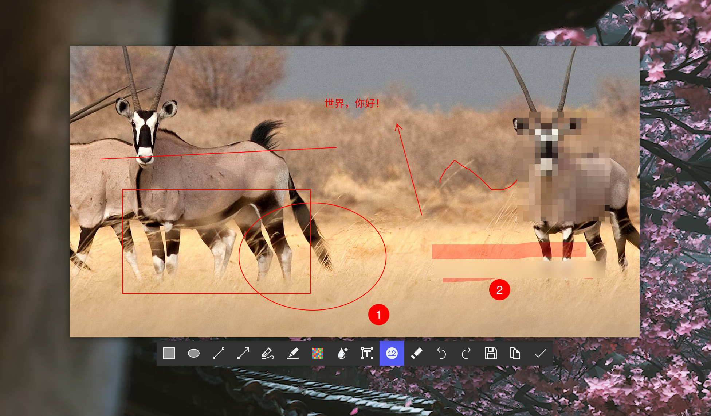

# sticky-rs

## 简介
这是一款使用Tauri开发的贴图软件（支持Linux系统），可以将图片钉在桌面上并置顶，还可以对图片进行标注。
支持如下标注工具：
- 矩形
- 椭圆
- 直线
- 箭头
- 铅笔
- 马克笔
- 马赛克
- 高斯模糊
- 文本
- 序号
- 橡皮擦

下面是软件界面的截图：


## 用法

```shell
Usage: sticky-rs --path <PATH>

Options:
  -p, --path <PATH>  Path of image to open
  -h, --help         Print help
  -V, --version      Print version
```
这款软件可以搭配`gnome-screenshot`一起使用，从而在Linux上实现Windows上的Snipaste软件的效果。下面是一个脚本，实现了截图并自动贴图：

```shell
#!/bin/bash

mkdir -p /tmp/screenshot-sticky
time=$(date "+%Y%m%d-%H-%M-%S")
tmp_file="/tmp/screenshot-sticky/${time}.png"
gnome-screenshot -c -a -f $tmp_file && /absolute-path/to/sticky-rs_x.x.x_amd64.AppImage -p "$tmp_file"
```

可以通过系统自带的快捷键功能设置一个快捷键，将自己喜欢的快捷键绑定到这个脚本，就可以实现一键截图并贴图了。
顺带一提，在Archlinux中可以这样安装gnome-screenshot:
```shell
sudo pacman -S gnome-screenshot
```