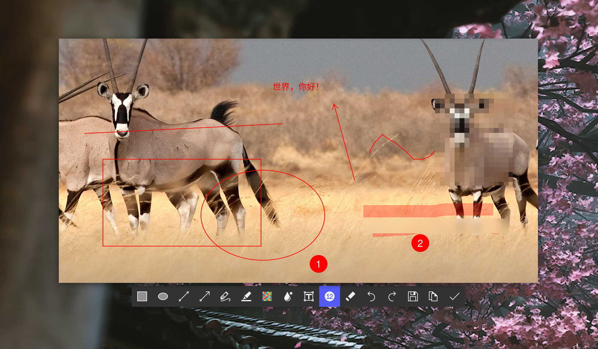

# sticky-rs

## Description（[中文简介](./README-CN.md)）
A Tauri-powered image sticky-note app, enabling users to affix pictures to their desktop and keep them always on display. It comes equipped with various annotation capabilities.
Among the annotation options are:

- Rectangular framing
- Oval framing
- Line drawing
- Arrow creation
- Freehand sketching
- Highlighter marker
- Pixelated masking
- Gaussian blurring
- Text overlay
- Step-by-step numbering
- Virtual eraser

Have a look at the software's interface through the screenshot provided:
